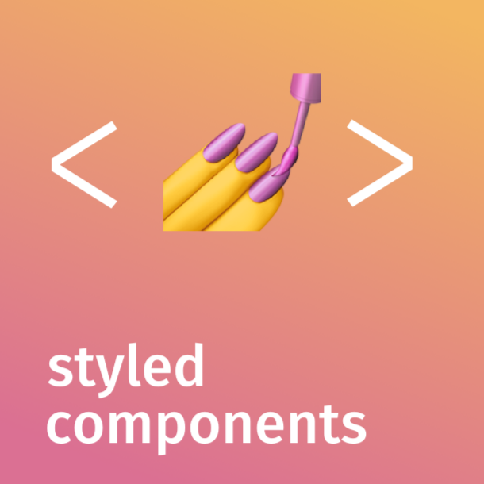

## The Shoppies

 

This Github repository contains the challege for the Shopify summer internship
application.

For this project, I had **three** main goals:

- **Mobile-friendliness & responsiveness**
- **Performance**
- **Clean animations & UI**

 

### Technologies

&nbsp;&nbsp;

&nbsp;&nbsp;

&nbsp;&nbsp;

 

### Features & Demos

Drag and drop list to rank nominations:

Items **save on reload**:

**Pagination**:

More info on a movie, **directly in the app**:

**Mobile support**:

Filter by year:

Behind the scenes, there's also **debouncing** of the search results.
