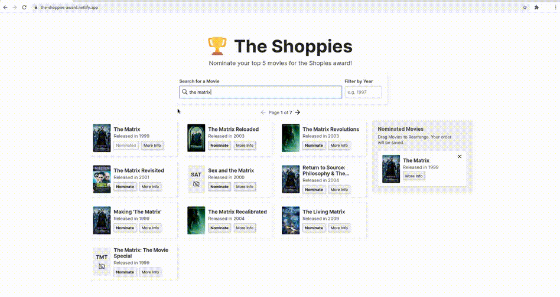
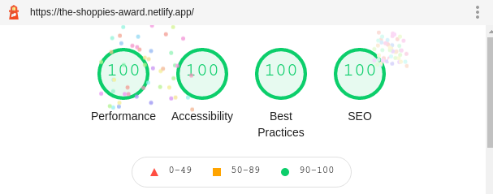

  
  <h2>The Shoppies</h2>
  
  
  <h4><a href="https://the-shoppies-award.netlify.app/">Live at <b>the-shoppies-award.netlify.app</b></a></h4>

 

This Github repository contains the challenge for the Shopify summer internship
application.

For this project, I had **three** main goals:

- **Mobile-friendliness & responsiveness**
- **Performance**
- **Clean animations & UI**

 

### Technologies

&nbsp;&nbsp;

&nbsp;&nbsp;

&nbsp;&nbsp;

 

### Features & Demos

**Mobile support, Gesture Based**:

More info on a movie, **directly in the app**:

Search with debouncing:

Drag and drop list to rank nominations:

Filter by year:

Items **save on reload**:

**Pagination**:

Good diagnostics:

The site also scores a 100 on each category with [**lighthouse**](https://developers.google.com/web/tools/lighthouse):

